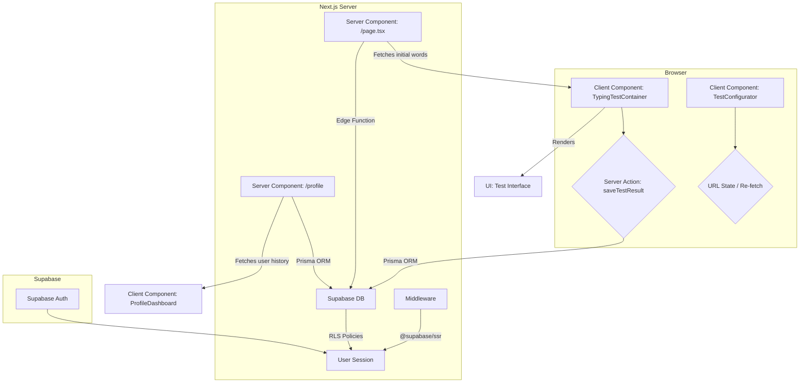

# Proyecto: monkeytype-clon Especificación técnica

## 1. Descripción general del sistema

### Propósito y valor principales Propuesta

Este proyecto es un clon 1:1 de Monkeytype, una popular aplicación de test de mecanografía. El objetivo es replicar la experiencia de usuario fluida y la funcionalidad principal, sirviendo como un caso de estudio para un stack tecnológico moderno (Next.js App Router, Supabase, Prisma, TailwindCSS). El valor reside en ofrecer a los desarrolladores y entusiastas de la mecanografía una herramienta de práctica de código abierto, limpia y de alto rendimiento, mientras se exploran patrones de desarrollo avanzados.

### Flujos de trabajo clave

1.  **Realizar un test (Anónimo):** Un usuario visita el sitio, recibe un conjunto de palabras por defecto y puede completar un test de mecanografía basado en tiempo. Los resultados se muestran pero no se guardan.
2.  **Realizar un test (Autenticado):** Un usuario inicia sesión, completa un test. Al finalizar, los resultados se calculan en el servidor para mayor seguridad y se guardan en su perfil.
3.  **Consultar Historial:** Un usuario autenticado visita su página de perfil para ver estadísticas agregadas y un historial de sus tests anteriores, incluyendo gráficos de progreso.
4.  **Configurar Test:** Antes de empezar, cualquier usuario puede seleccionar la duración del test y la lista de palabras a utilizar.

### Arquitectura del sistema

El sistema utilizará una arquitectura desacoplada basada en Next.js con el App Router.



## 2. Estructura del proyecto

```
monkeytype-clon/
├── app/
│   ├── (main)/
│   │   ├── layout.tsx         # Layout principal con providers
│   │   └── page.tsx           # Página de inicio (Server Component)
│   ├── (auth)/
│   │   ├── login/page.tsx
│   │   └── signup/page.tsx
│   ├── profile/
│   │   └── page.tsx           # Página de perfil (Server Component)
│   └── api/
│       └── words/
│           └── [wordlist]/
│               └── route.ts   # Edge API Route para obtener palabras
├── actions/
│   └── test.ts                # Server Action para guardar resultados
├── components/
│   ├── ui/                    # Componentes Shadcn/UI generados
│   ├── core/
│   │   ├── TypingTestContainer.tsx # Lógica principal del test (Client)
│   │   ├── Character.tsx        # Componente para cada letra (Client, memoized)
│   │   ├── Caret.tsx            # Cursor visual (Client)
│   │   ├── Results.tsx          # Pantalla de resultados (Client)
│   │   └── ProfileChart.tsx     # Gráfico de historial (Client)
│   └── layout/
│       ├── Header.tsx
│       └── ThemeToggle.tsx
├── lib/
│   ├── db.ts                  # Instancia de Prisma Client
│   ├── supabase.ts            # Clientes Supabase SSR (client/server)
│   ├── types.ts               # Definiciones de TypeScript
│   └── utils.ts               # Funciones de utilidad (cn, etc.)
├── prisma/
│   ├── schema.prisma          # Esquema de la base de datos
│   └── seed.ts                # Script de seeding de datos
├── styles/
│   └── globals.css            # Estilos globales de Tailwind
├── .env.local                   # Variables de entorno
├── middleware.ts                # Middleware para rutas protegidas
└── next.config.mjs              # Configuración de Next.js
```

## 3. Especificación de las características

### 3.1 Core: Experiencia de Test de Mecanografía

- **Historia de usuario y requisitos:** Como usuario, quiero ver un bloque de texto y escribirlo lo más rápido y preciso posible. Quiero recibir feedback visual instantáneo sobre mi rendimiento y ver mis resultados (WPM, precisión) al final.
- **Pasos detallados de implementación:**
  1.  **Obtención de datos:** El Server Component `app/page.tsx` obtendrá un array de palabras de la Edge Function y las pasará al `TypingTestContainer`.
  2.  **Estado del componente:** `TypingTestContainer` (Client Component) gestionará el estado del test, preferiblemente con `useReducer`. El estado incluirá:
      - `words`: `Array<{text: string, status: 'pending' | 'correct' | 'incorrect'}>`
      - `status`: `'waiting' | 'running' | 'finished'`
      - `timer`: número de segundos restantes.
      - `userInput`: el string completo que el usuario ha escrito.
      - `stats`: `{ wpm: number, accuracy: number }`
  3.  **Renderizado:** El componente mapeará sobre el array de palabras. Cada palabra se dividirá en caracteres, renderizados por el componente `<Character>`.
  4.  **Componente `<Character>`:** Será un `<span>` envuelto en `React.memo`. Recibirá `char` y `status` (`correct`, `incorrect`, `pending`, `extra`). Aplicará clases de TailwindCSS condicionalmente para el color.
  5.  **Entrada de teclado:** Se adjuntará un `useEffect` con un listener de `keydown` al montar el componente. El área de texto se enfocará automáticamente al cargar y reiniciar.
  6.  **Lógica de `keydown`:**
      - Si es un carácter imprimible: se añade a `userInput`. Se compara con el carácter esperado. Se actualiza el estado del carácter correspondiente.
      - Si es `Backspace`: se elimina el último carácter de `userInput`. Se actualiza el estado del carácter correspondiente a 'pending'. No se permite borrar caracteres de palabras ya completadas.
      - Si es `Space`: finaliza la palabra actual. Si la palabra es incorrecta, se marca como tal. Mueve el cursor al inicio de la siguiente palabra.
  7.  **Caret:** El componente `<Caret>` será un `<span>` posicionado de forma absoluta. Su posición se calculará con `useLayoutEffect` basándose en la `offsetLeft` y `offsetTop` del `<span>` del carácter activo. Se animará con `transition: all 100ms ease`.
  8.  **Temporizador:** Un `useEffect` iniciará un `setInterval` de 1 segundo cuando `status` sea `'running'`. Decrementará el `timer`. Cuando llegue a 0, cambiará `status` a `'finished'`.
  9.  **Cálculo de métricas (cliente):** El WPM (Palabras por Minuto) se calculará en cada `keystroke`: `(caracteresCorrectos / 5) / (tiempoTranscurridoEnMinutos)`. La precisión: `(caracteresCorrectos / totalCaracteresEscritos) * 100`.
  10. **Finalización:** Cuando `status` sea `'finished'`, se mostrará el componente `<Results>`. Si el usuario está autenticado, se llamará a la Server Action `saveTestResult`.
- **Manejo de errores y casos extremos:**
  - Si la obtención de palabras falla, mostrar un mensaje de error y un botón para reintentar.
  - El usuario puede escribir más caracteres de los que tiene la palabra (caracteres "extra"). Estos se marcarán visualmente como un error.
  - La entrada se deshabilita cuando `status` es `'finished'`.

### 3.2 Cuentas de Usuario y Autenticación

- **Historia de usuario y requisitos:** Como usuario, quiero crear una cuenta para guardar mi progreso y ver mi historial.
- **Pasos detallados de implementación:**
  1.  Configurar el proyecto de Supabase y obtener las claves de API.
  2.  Instalar `@supabase/auth-helpers-nextjs` (o el recomendado `@supabase/ssr`).
  3.  Crear un archivo `lib/supabase.ts` que exporte un cliente de Supabase para uso en el lado del servidor y otro para el lado del cliente, siguiendo la documentación de `@supabase/ssr`.
  4.  Crear las páginas `/login` y `/signup` con formularios. Usar `react-hook-form` y `zod` para la validación del lado del cliente.
  5.  Al enviar el formulario, llamar a los métodos `supabase.auth.signInWithPassword()` o `supabase.auth.signUp()`.
  6.  Crear `middleware.ts` en la raíz del proyecto. Usará `createMiddlewareClient` de `@supabase/ssr` para refrescar la sesión y proteger rutas.
  7.  La ruta `/profile` se añadirá a las rutas protegidas en el `matcher` del middleware.
- **Manejo de errores y casos extremos:**
  - Mostrar errores de autenticación de Supabase (p. ej., "Contraseña incorrecta", "Usuario ya existe") en el formulario.

### 3.3 Persistencia de Datos y Perfil

- **Historia de usuario y requisitos:** Como usuario autenticado, quiero que mis resultados de test se guarden automáticamente y poder verlos en mi página de perfil.
- **Pasos detallados de implementación:**
  1.  La página `/profile/page.tsx` (Server Component) obtendrá la sesión del usuario.
  2.  Si hay usuario, consultará la base de datos con Prisma para obtener todos los `TestResult` donde `userId` coincida. `await db.testResult.findMany({ where: { userId: user.id }, orderBy: { createdAt: 'desc' } })`.
  3.  Los datos se pasarán a un Client Component, `ProfileDashboard`.
  4.  `ProfileDashboard` usará una librería como `recharts` o `chart.js` para visualizar los datos (p. ej., WPM a lo largo del tiempo).
  5.  También mostrará una tabla con el historial detallado de tests.
- **Manejo de errores y casos extremos:**
  - Si el usuario accede a `/profile` sin sesión, el middleware lo redirigirá.
  - Si falla la carga de datos del perfil, mostrar un estado de error.

## 4. Esquema de la base de datos

Se utilizará `schema.prisma`.

### 4.1 Tablas

```prisma
// This is your Prisma schema file,
// learn more about it in the docs: https://pris.ly/d/prisma-schema

generator client {
  provider = "prisma-client-js"
}

datasource db {
  provider  = "postgresql"
  url       = env("DATABASE_URL")
  directUrl = env("DIRECT_URL") // For Prisma Migrate/Studio
}

// Corresponds to Supabase's auth.users table
model User {
  id          String       @id @default(uuid())
  email       String?      @unique
  // Add other fields you need from auth.users
  testResults TestResult[]
}

model WordList {
  id      String @id @default(cuid())
  name    String @unique
  lang    String
  words   Word[]
  tests   TestResult[]
}

model Word {
  id         String   @id @default(cuid())
  text       String
  wordList   WordList @relation(fields: [wordListId], references: [id])
  wordListId String

  @@index([wordListId])
}

model TestResult {
  id         String   @id @default(cuid())
  wpm        Int
  accuracy   Float
  duration   Int // in seconds
  createdAt  DateTime @default(now())

  // Relation to User
  user       User     @relation(fields: [userId], references: [id])
  userId     String

  // Relation to WordList
  wordList   WordList @relation(fields: [wordListId], references: [id])
  wordListId String

  @@index([userId, createdAt])
}
```

### 4.2 Políticas de Seguridad (RLS) en Supabase SQL

```sql
-- Habilitar RLS para la tabla TestResult
ALTER TABLE "TestResult" ENABLE ROW LEVEL SECURITY;

-- Los usuarios pueden ver sus propios resultados
CREATE POLICY "Allow users to read their own test results"
ON "TestResult" FOR SELECT
USING (auth.uid() = "userId");

-- Los usuarios pueden insertar resultados para sí mismos
CREATE POLICY "Allow users to insert their own test results"
ON "TestResult" FOR INSERT
WITH CHECK (auth.uid() = "userId");

-- Nadie puede actualizar o eliminar resultados por ahora para mantener la integridad
-- (Se puede añadir una política de UPDATE/DELETE si es necesario en el futuro)
```

## 5. Acciones del servidor

### 5.1 Acciones de la base de datos

- **`saveTestResult`**
  - **Descripción:** Se invoca después de que un usuario autenticado completa un test. Recalcula las métricas en el servidor y guarda el resultado en la base de datos.
  - **Archivo:** `actions/test.ts`
  - **Parámetros de entrada:** `(formData: FormData)` o `(payload: { rawInput: string; duration: number; wordListId: string; words: string[] })`
  - **Valores de retorno:** `Promise<{ success: true; testId: string } | { success: false; error: string }>`
  - **Operaciones ORM:**
    1.  Obtener la sesión del usuario desde el cookie store (`@supabase/ssr`). Si no hay sesión, retornar error.
    2.  **Recalcular métricas en el servidor:**
        - Iterar sobre `rawInput` y `words` para determinar caracteres correctos.
        - Calcular WPM y precisión de forma segura.
    3.  Llamar a `db.testResult.create()` con los datos calculados, el `userId` de la sesión, `duration` y `wordListId`.
    4.  Envolver la operación en un bloque `try/catch`. En caso de error, retornar `{ success: false, error: '...' }`.

## 6. Sistema de diseño

### 6.1 Estilo visual

- **Paleta de colores (Inspirada en Monkeytype):** Se usarán variables CSS para soportar temas.
  - **Light:**
    - `--background`: `#FFFFFF` (Blanco)
    - `--foreground`: `#334155` (Slate 700)
    - `--card`: `#F8FAFC` (Slate 50)
    - `--primary`: `#475569` (Slate 600)
    - `--muted-foreground`: `#64748B` (Slate 500) - Texto del test
    - `--accent`: `#10B981` (Green 500) - Caracteres correctos
    - `--destructive`: `#EF4444` (Red 500) - Caracteres incorrectos
  - **Dark:**
    - `--background`: `#0F172A` (Slate 900)
    - `--foreground`: `#E2E8F0` (Slate 200)
    - `--card`: `#1E293B` (Slate 800)
    - `--primary`: `#CBD5E1` (Slate 300)
    - `--muted-foreground`: `#94A3B8` (Slate 400) - Texto del test
    - `--accent`: `#34D399` (Green 400) - Caracteres correctos
    - `--destructive`: `#F87171` (Red 400) - Caracteres incorrectos
- **Tipografía:** Se usará `next/font`.
  - **Fuente Principal:** `Inter` (o una sans-serif del sistema como fallback). Tamaños: `1rem` para texto normal, `1.5rem` para el texto del test.
- **Espaciado:** Se usará el sistema de espaciado de Tailwind (`space-x-4`, `p-8`, etc.) para consistencia.

### 6.2 Componentes principales

- **Diseño:** Un layout principal con un `Header` en la parte superior y un `Footer` en la parte inferior. El contenido principal estará centrado.
- **Navegación:** `Header` contendrá enlaces a la página de inicio, y condicionalmente a `/profile` y un botón de `Logout` si el usuario está autenticado, o a `/login` y `/signup` si no lo está.
- **Componentes compartidos:**
  - `Button` (de Shadcn): Para todas las acciones clicables.
  - `Card` (de Shadcn): Para contener la pantalla de resultados.
  - `Toast` (de Shadcn): Para notificaciones no intrusivas.
- **Estados interactivos:**
  - `hover`: Los botones y enlaces cambiarán de brillo/color.
  - `focus`: Los elementos de formulario tendrán un `ring` de enfoque visible.
  - `disabled`: Los botones se verán opacos y no tendrán `pointer-events`.

## 7. Arquitectura de componentes

### 7.1 Componentes del servidor

- **`app/page.tsx`**
  - **Obtención de datos:** Llama a la Edge Function `api/words/english_1k` para obtener el set de palabras inicial.
  - **Interfaz de props:** Pasa `initialWords: string[]` al componente cliente `TypingTestContainer`.
- **`app/profile/page.tsx`**
  - **Obtención de datos:** Obtiene la sesión. Si existe, usa Prisma para obtener el historial de tests del usuario (`TestResult[]`).
  - **Interfaz de props:** Pasa `testHistory: TestResult[]` al componente cliente `ProfileDashboard`.

### 7.2 Componentes del cliente

- **`TypingTestContainer.tsx`**
  - **Gestión de estados:** `useReducer` para gestionar el estado del test (ver sección 3.1). `useState` para la configuración del test (duración, lista de palabras).
  - **Controladores de eventos:** `handleKeyDown` para procesar la entrada del teclado.
  - **Interfaz de props:**
    ```typescript
    interface TypingTestContainerProps {
      initialWords: string[];
      wordLists: { id: string; name: string }[];
    }
    ```
- **`Character.tsx`**
  - **Gestión de estados:** Ninguno, es un componente de presentación.
  - **Interacciones:** Ninguna.
  - **Interfaz de props:**
    ```typescript
    interface CharacterProps {
      char: string;
      status: "pending" | "correct" | "incorrect" | "extra";
    }
    // envuelto en React.memo
    export const Character = React.memo(CharacterComponent);
    ```

## 8. Autenticación y autorización

- **Implementación de auth:** Se utilizará `supabase.auth.signInWithPassword`, `signUp`, y `signOut` del cliente de Supabase. El manejo de la sesión se delega a `@supabase/ssr`.
- **Rutas protegidas:** `middleware.ts` protegerá el `matcher: ['/profile']`. Verificará la existencia de una sesión usando `supabase.auth.getSession()` del middleware y redirigirá a `/login` si no existe.
- **Gestión de sesiones:** `@supabase/ssr` se encargará de leer y escribir cookies de sesión, asegurando que tanto el servidor como el cliente tengan una vista consistente del estado de autenticación.
- **Autorización:** La autorización a nivel de datos se implementará con las políticas RLS de Supabase definidas en la sección 4.2.

## 9. Flujo de datos

1.  **Carga Inicial:** `Server Component (Page)` -> `fetch(api/words)` -> Pasa `props` a `Client Component (TypingTestContainer)`.
2.  **Interacción del Test:** `Client Component` gestiona su estado internamente.
3.  **Guardado de Resultados:** `Client Component` -> invoca `Server Action (saveTestResult)`.
4.  **Flujo de la Acción:** `Server Action` -> lee la sesión -> recalcula métricas -> escribe en `DB (Prisma)` -> devuelve `{ success, ... }` al `Client Component`.
5.  **Carga de Perfil:** `Server Component (Profile)` -> lee la sesión -> lee de `DB (Prisma)` -> Pasa `props` a `Client Component (ProfileDashboard)`.

## 10. Integración con Stripe

- No aplicable para el MVP.

## 11. Vercel analitycs

- No aplicable para el MVP.

## 12. Pruebas

### Pruebas unitarias con Jest

- **Utilidades de cálculo:**

  ```javascript
  // __tests__/metrics.test.ts
  import { calculateWPM } from "../lib/metrics";

  describe("calculateWPM", () => {
    it("should calculate WPM correctly for a 60-second test", () => {
      // 100 correct chars / 5 = 20 words. In 60s (1 min) => 20 WPM.
      expect(calculateWPM(100, 60)).toBe(20);
    });

    it("should calculate WPM correctly for a 30-second test", () => {
      // 100 correct chars / 5 = 20 words. In 30s (0.5 min) => 40 WPM.
      expect(calculateWPM(100, 30)).toBe(40);
    });
  });
  ```

- **Lógica del Reducer:** Se pueden probar las transiciones de estado del reducer del test de forma aislada.

### Pruebas extremo a extremo con Playwright

- **Flujo 1: Completar test como invitado.**

  ```javascript
  // e2e/guest-test.spec.ts
  test("completes a typing test as a guest", async ({ page }) => {
    await page.goto("/");
    await expect(page.locator('[data-testid="typing-area"]')).toBeVisible();

    // Espera a que el temporizador sea visible (p. ej., '60')
    await expect(page.locator('[data-testid="timer"]')).toHaveText("60");

    // Simular escritura (el método exacto dependerá de la implementación)
    await page.locator("body").pressSequentially("the quick brown fox");

    // Esperar a que el test finalice (el temporizador llegue a 0 o se muestren los resultados)
    await expect(page.locator('[data-testid="results-wpm"]')).toBeVisible();
    await expect(page.locator('[data-testid="results-wpm"]')).not.toHaveText(
      "0"
    );
  });
  ```

- **Flujo 2: Registrarse, completar test y verificar en perfil.**
  1.  Navegar a `/signup` y rellenar el formulario para crear un nuevo usuario.
  2.  Verificar que se redirige a la página principal y que el header muestra el estado de "logueado".
  3.  Completar un test de mecanografía.
  4.  Esperar a que se muestre el estado "Guardado" (o que desaparezca "Guardando...").
  5.  Navegar a `/profile`.
  6.  Verificar que la tabla de historial contiene una entrada para el test recién completado con las métricas correctas.
